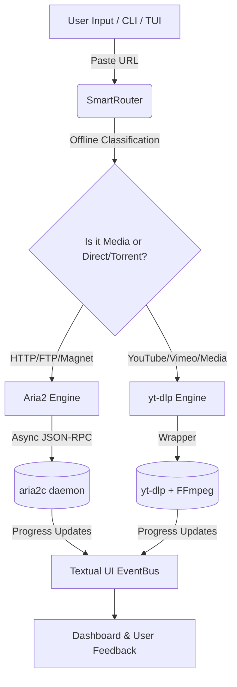

<div align="center">
  <!-- Project Logo / Icon Placeholder -->
  
  

  # 🚀 PyFlow Omni

  **The ultimate All-in-One CLI & TUI download manager bridging direct, torrent, and media extraction seamlessly.**

  <!-- Tech Stack Badges (Buttons) -->
  <p align="center">
    <a href="https://www.python.org/"></a>
    <a href="https://aria2.github.io/"></a>
    <a href="https://github.com/yt-dlp/yt-dlp"></a>
    <a href="https://ffmpeg.org/"></a>
    <a href="https://textual.textualize.io/"></a>
  </p>
</div>

---

## 📖 Overview

PyFlow Omni is a single CLI/TUI application that bridges direct/torrent downloading (aria2c) and media extraction (yt-dlp + FFmpeg)[cite: 33]. Simply paste a link — a `SmartRouter` figures out whether it's a file, a magnet/torrent, or a video/audio platform URL, and automatically routes it to the right engine[cite: 33]. Casual users get a one-key-press default setup, while power users are equipped with a full session Quick Config, queue management, retries, scheduling, and a bandwidth scheduler[cite: 33]. 

---

## ✨ Advanced Features

*   🧠 **Smart Routing:** Magnet / `.torrent` / HTTP(S) / FTP / batch `.txt` files go directly to aria2c[cite: 33]. Recognised media platform URLs go to yt-dlp — detected entirely offline with no network calls[cite: 33].
*   ⚡ **Aria2 Engine:** Features a hand-rolled async JSON-RPC client, auto-starts/stops its own aria2c daemon, handles live log streaming, and manages the magnet metadata→content GID handoff correctly[cite: 33].
*   🎬 **yt-dlp Engine:** Comes with 8 quality presets (original, 4K PC-TV, 1080p mobile, legacy 3GP feature-phone, 320kbps MP3, FLAC, compact HEVC+Opus archive, clip range) plus a Manual Mode with playlist checkboxes and thread-safe progress reporting[cite: 33].
*   🖥️ **Full Textual TUI:** A stunning visual interface featuring a main menu, per-engine pre-flight and progress screens, a global settings editor, and a post-download dashboard[cite: 33].
*   🛠️ **Power User Tools:** Pause/resume/cancel per task, Smart Retry with exponential backoff on failures, clipboard monitoring, `--schedule` for delayed starts, and a time-windowed bandwidth scheduler[cite: 33].
*   👻 **Headless Mode (`--no-tui`):** The same router and engines, driven from a script with Rich progress bars and clean SIGINT/SIGTERM handling[cite: 33].

---

## 🏗️ Architecture & Data Flow

Our modern architecture ensures that engines never talk to the UI directly. Every screen drives them through a unified interface, maintaining clean, scalable, and isolated logic[cite: 33].



### 📁 Directory Structure

```text
pyflow_omni/
├── cli.py                 # click-based entry point; --no-tui headless mode[cite: 33]
├── config_manager.py      # AppConfig dataclasses, atomic YAML load/save[cite: 33]
├── router.py              # SmartRouter — offline classification[cite: 33]
├── engines/
│   ├── base.py            # Engine ABC, ProgressUpdate/DownloadResult[cite: 33]
│   ├── aria2_engine.py    # async JSON-RPC client + daemon lifecycle[cite: 33]
│   └── ytdlp_engine.py    # yt_dlp wrapper, 8 presets, ffmpeg post-passes[cite: 33]
├── tui/
│   ├── app.py             # PyFlowOmniApp — theme, routing, schedulers[cite: 33]
│   ├── app.tcss           # stylesheet[cite: 33]
│   └── screens/           # TUI Screen modules[cite: 33]
└── utils/                 # async, subprocess, clipboard, and file utils[cite: 33]

```

---

## 📸 Screenshots

*(Replace the image paths below with actual screenshots of your app once uploaded to the `assets/` folder)*


---

## 🚀 Installation & Usage Guidelines

### Method 1: Using Python (For Developers & Power Users)

**1. Install System Dependencies (Not pip-installable):**

```bash
# Debian/Ubuntu
sudo apt install aria2 ffmpeg

# macOS
brew install aria2 ffmpeg

# Windows
# Download and add aria2c and FFmpeg to your System PATH.
```

(Reference: System dependencies instructions)

**2. Install PyFlow Omni:**

```bash
# Clone the repository
git clone https://github.com/mmizan85/pyflow-omni.git
cd pyflow-omni

# Install via pip
pip install -e .
# Alternatively: pip install -r requirements.txt && python -m pyflow_omni
```

(Reference: Package installation instructions)

---

### Method 2: Using the Windows Installer (.exe)

For general Windows users, you don't need Python installed. Just use our standalone installer!

1. Go to the [Releases](https://github.com/mmizan85/PyFlow-Omni/releases/tag/v1.0.0) page of this GitHub repository.
2. Download the latest `PyFlow-Omni-Setup-v1.0.0.exe` file.
3. Run the installer and follow the on-screen instructions.
4. Ensure you check the **"Add 'pfo' to System PATH"** box during installation.
5. Open Terminal or Command Prompt and type `pfo` to launch the app instantly!

---

## 💻 CLI Parameters & Highest Usage Commands

PyFlow Omni provides a powerful CLI interface alongside the TUI. Here are the most useful commands:

| Command | Action / Usage |
| --- | --- |
| `pyflow-omni` | Launch the interactive TUI (scans clipboard first for links).|
| `pyflow-omni "https://example.com/file.zip"` | Launch TUI, pre-filled with the provided URL. |
| `pyflow-omni links.txt --no-tui` | Run headless batch downloading with Rich progress bars. |
| `pyflow-omni "<url>" --no-tui --output-dir ~/Downloads/movies` | Headless download targeting a specific output directory. |
| `pyflow-omni "<url>" --engine ytdlp` | Force a specific engine instead of relying on auto-detect. |
| `pyflow-omni "<url>" --schedule "2026-08-01 03:00"` | Schedule a download for a specific future date and time. |
| `pyflow-omni --config` | Open the permanent global settings editor directly. |

---

## 👨‍💻 Development & Credits

**PyFlow Omni** was designed and developed by **Mohammad Mizanur Rahman (Mohammad Mizan)**.
Built out of a passion for system automation, CLI environments, and robust software architecture, this project was created to merge multiple complex downloading technologies (Aria2, yt-dlp, FFmpeg) into one unified, elegant, and user-friendly Textual interface. Every line of code, TUI design, and asynchronous networking logic has been meticulously crafted to provide a professional-grade downloading experience.

---

## 🤝 Contributing

We want to make PyFlow Omni even better! If you are a developer interested in asynchronous Python, TUI design, or networking, your help is highly appreciated.

* **Found a bug?** Open an Issue.
* **Have a feature idea?** Start a Discussion.
* **Want to fix something?** Fork the repo, create a feature branch, and submit a Pull Request!

Let's build the ultimate open-source downloader together. ❤️

---

## 📄 License

This project is licensed under the **MIT License(MIT)**. See [LICENSE](https://github.com/mmizan85/pyflow-omni/blob/main/LICENSE) for more details.

